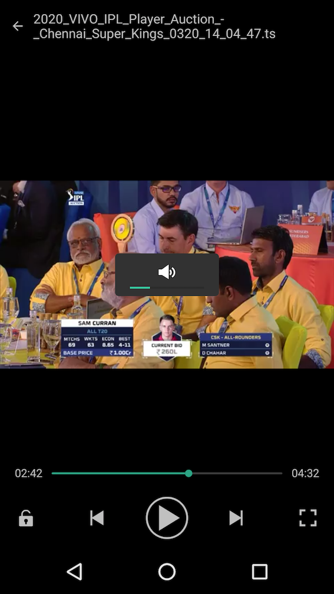

LibVideoPlayer
========

This repo is for VideoPlayer

my blog: [https://blog.csdn.net/intbird/article/details/105970536](https://blog.csdn.net/intbird/article/details/105970536)

video demo: [https://player.bilibili.com/player.html?aid=668088806](https://player.bilibili.com/player.html?aid=668088806)




step
--------
#### 1.add maven url in root project `build.gradle` file
```
repositories {
    google()
    jcenter()
    maven { url "http://intbird.world:8081/nexus/content/repositories/releases/" }
```


#### 2.add dependence in app project `build.gradle` file
```
dependencies {
     implementation 'intbird.soft.lib:video-player:$lastVersion'
     implementation 'intbird.soft.lib:video-player-api:$lastVersion'
}
```


#### 3.add method in your code where you need to play video.
```
 var path = "$video path"
 ServicesLoader.load(IVideoPlayer::class.java)?.startActivity(this, arrayListOf(path,path,path), defaultStartIndex=0)
```

Release
--------
see [change log](CHANGELOG.md) has release history.

newest $versionName is v1.0.1

```
dependencies {
   implementation "intbird.soft.lib:video-player:$versionName"
   implementation "intbird.soft.lib:video-player-api:$versionName"
}
```