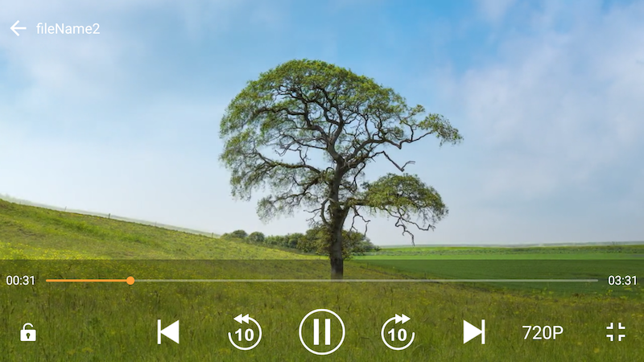

LibVideoPlayer
========

This repo is for VideoPlayer

my blog: [https://blog.csdn.net/intbird/article/details/105970536](https://blog.csdn.net/intbird/article/details/105970536)

# Overview  
### fragment

### touch

### landcape


How to Use it
--------
#### 1.add maven url in root project `build.gradle` file
```
repositories {
    google()
    jcenter()
    maven { url "https://intbird.ml/maven/releases/" }
```


#### 2.add dependence in app project `build.gradle` file
```
dependencies {
     implementation 'intbird.soft.lib:video-player:$lastVersion'
     implementation 'intbird.soft.lib:video-player-api:$lastVersion'
}
```


#### 3.add method in your code where you need to play video.
```
        val itemTestIndex = 4
    
        val itemTestUrl1 = "file:///sdcard/videos/test1.mp4"
        val itemTestUrl2 = "file:///sdcard/videos/test2.mp4"
        val itemTestUrl3 = "file:///sdcard/videos/test3.mp4"
        val itemTestUrl4 = "https://intbird.s3.ap-northeast-2.amazonaws.com/476426784_mp4_h264_aac_hq.m3u8"
        val itemTestUrl5 = "https://llvod.mxplay.com/video/d89b306af415d293a66a74a26c560ab5/2/hls/h264_baseline.m3u8"
...

        // used as a fragment
        add1.setOnClickListener { addVideoPlayer(R.id.fragment_player, MediaPlayerStyle.SHOW_LAST_NEXT) }
        add2.setOnClickListener { addVideoPlayer(R.id.fragment_player, MediaPlayerStyle.SHOW_BACKWARD_FORWARD) }
        remove.setOnClickListener { removeAudioPlayer(R.id.fragment_player) }
        last.setOnClickListener { fragment?.setVideoPlayerLast() }
        pause.setOnClickListener { fragment?.getVideoPlayerController()?.pause() }
        next.setOnClickListener { fragment?.setVideoPlayerNext() }

       
        // full screen :  MediaPlayerStyle.HIDE_LAST_NEXT
        ServicesLoader.load(IVideoPlayer::class.java)?.startActivity(this, arrayListOf(itemTest1, itemTest2, itemTest3, itemTest4, itemTest5), itemTestIndex)
        
     
        // full screen :  MediaPlayerStyle.HIDE_BACKWARD_FORWARD
        ServicesLoader.load(IVideoPlayer::class.java)?.startActivity(this, arrayOf(itemTestUrl1, itemTestUrl2, itemTestUrl3, itemTestUrl4, itemTestUrl5), itemTestIndex)
       
```

Release
--------
see [change log](CHANGELOG.md) has release history.

newest $versionName is v1.1.0

```
dependencies {
   implementation "intbird.soft.lib:video-player:$versionName"
   implementation "intbird.soft.lib:video-player-api:$versionName"
}
```

------

# ScreenShoots

## DemoActivity  


## style1 portrait


## style1 landscape


## style2 portrait


## style2 landscape


##  slide progress


## slide light


## slide volume


##  choose clarity


##  locker


##  developing...