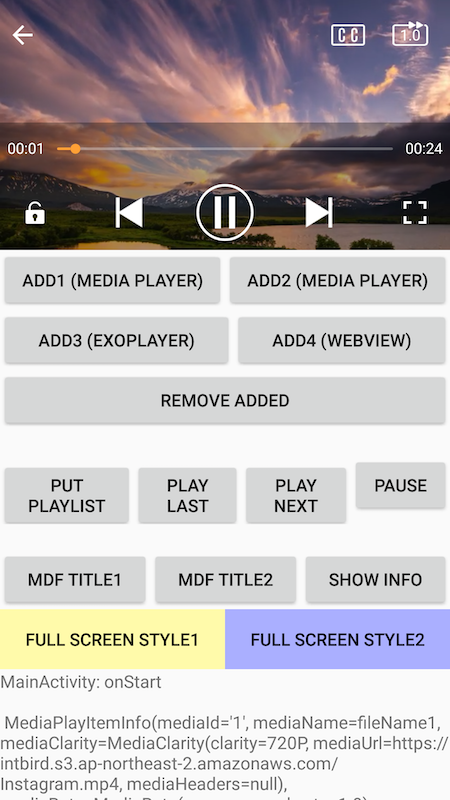

LibVideoPlayer
========

This repo is for VideoPlayer

my website: [https://intbird.net](https://intbird.net)  

my blog: [https://blog.csdn.net/intbird/article/details/105970536](https://blog.csdn.net/intbird/article/details/105970536)

# Overview  
### fragment
#### play, pause, last, next... & resolution, subtitle, speed...


### touch
#### progress, volume, brightness, doubleTap...


### landscape
##### auto rotate screen 


How to Use it
--------
#### 1.add maven url in root project `build.gradle` file
```
repositories {
    google()
    jcenter()
    maven { url "https://intbird.net/maven/releases/" }
```


#### 2.add dependence in app project `build.gradle` file
```
dependencies {
     implementation 'intbird.soft.lib:video-player:$lastVersion'
     implementation 'intbird.soft.lib:video-player-api:$lastVersion'
}
```


#### 3.add method in your code where you need to play video.

1. support
```
        intbird.soft.lib.video.player.main.player.player.ExoPlayerImpl

        intbird.soft.lib.video.player.main.player.player.MediaPlayerImpl

        intbird.soft.lib.video.player.main.player.player.WebViewPlayerImpl

```

2. useage
```
        
        val itemTestUrl1 = "file:///sdcard/videos/Instagram_0312_10_19_20.mp4"
        val itemTestUrl2 = "https://intbird.s3.ap-northeast-2.amazonaws.com/h264_baseline.m3u8"


         // use as a fragment
        add1.setOnClickListener { 
            addVideoPlayer(R.id.fragment_player, MediaPlayerType.PLAYER_STYLE_1) 
        }
        
        add2.setOnClickListener { 
            addVideoPlayer(R.id.fragment_player, MediaPlayerType.PLAYER_STYLE_2)
        }

        add3.setOnClickListener { 
            addVideoPlayer(R.id.fragment_player, MediaPlayerType.PLAYER_STYLE_3)
        }
        remove.setOnClickListener { removeAudioPlayer(R.id.fragment_player) }


       

        // full screen activity
        fullScreen1.setOnClickListener {
            ServicesLoader.load(IVideoPlayer::class.java)?.startActivity(this, itemTestArrayModel, itemTestIndex, autoPlay = true)
        }

        // full screen activity
        fullScreen2.setOnClickListener {
            ServicesLoader.load(IVideoPlayer::class.java)?.startActivity(this, itemTestArrayString, itemTestIndex,autoPlay = true)
        }
```

3. control
```
        reset.setOnClickListener {
            videoPlayerFragment?.setVideoPlayerList(itemTestArray3, itemTestIndex,true)
        }
        last.setOnClickListener {
             videoPlayerFragment?.getVideoPlayerController()?.last() 
        }
        pause.setOnClickListener { 
            videoPlayerFragment?.getVideoPlayerController()?.pause()
        }
        next.setOnClickListener { 
            videoPlayerFragment?.getVideoPlayerController()?.next() 
        }
        info.setOnClickListener { 
            stateText.text = "info:${ videoPlayerFragment?.getVideoPlayerStateInfo()?.getVideoPlayingItemInfo()}" }

```


Release
--------
see [change log](CHANGELOG.md) has release history.

newest $versionName is v1.1.2-SNAPSHOT

```
dependencies {
   implementation "intbird.soft.lib:video-player:$versionName"
   implementation "intbird.soft.lib:video-player-api:$versionName"
}
```

------

# ScreenShoots

## DemoActivity  


## style1 portrait


## style1 landscape


## style2 portrait


## style2 landscape


##  slide progress


## slide light


## slide volume


##  choose clarity


##  locker


##  developing...